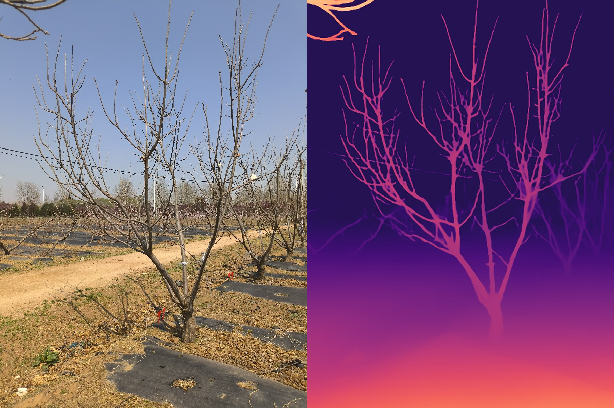
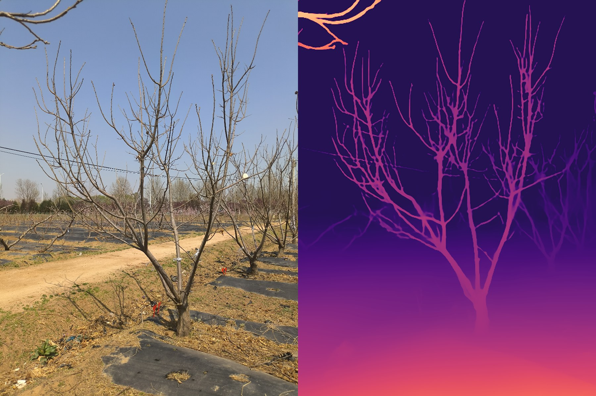

# Agri Depth Estimation — 农业场景单目深度感知

> Monocular **depth estimation** on real chestnut-orchard field photos using
> **Depth Anything V2 (Small)**, for canopy / crop depth perception in
> agri-robotics scenarios. Single RGB photo → dense depth map.

用 **Depth Anything V2（Small）** 在真实板栗园田间照片上做**单目深度估计**，面向农业机器人的
树冠/作物**深度感知**。输入一张普通 RGB 照片，输出稠密深度图。

## Demo / 效果（RGB | 深度图）

输入是手机拍的板栗树田间图，右侧为模型预测的彩色深度图（近暖远冷）。





Branch structure is cleanly resolved and the near→far ground gradient is correct —
useful as a depth cue for canopy distance / obstacle sensing on field robots.
树枝结构清晰、地面近远梯度正确，可作为田间机器人的树冠距离/避障深度线索。

## Why / 应用背景

Agri-robots (drones, ground rovers) need depth perception but stereo/LiDAR rigs are
costly. Monocular depth from a single camera is a cheap complementary cue. This is an
**applied** use of a public pretrained model on my own field dataset.

农业机器人需要深度感知，但双目/激光雷达成本高；单目深度估计是低成本的补充线索。
本项目是把公开预训练模型**应用**到自己采集的田间数据上。

## How it works / 原理

```text
RGB photo → Depth Anything V2 (ViT-S encoder, DPT head) → relative depth map → colorize
```

Runs on Apple Silicon (MPS). 本地 MPS 推理。

## Tech stack

`Python` · `PyTorch (MPS)` · `Transformers` · `Depth Anything V2` · `OpenCV`

## Usage

```bash
pip install -r requirements.txt
python depth_estimate.py --images /path/to/field_images --n 3
```

## Notes / 说明

- **Depth Anything V2** © its authors, used here as a pretrained dependency under its
  own license. This repo contains my pipeline/visualization code and results on my data.
  深度模型版权归原作者，本仓库是我在自有数据上的应用代码与结果。
- The 3 field photos are my own (chestnut orchard, 2025). 样例图为本人采集。

## Author

**Zhao Zihang / 赵梓航** — agricultural CV · depth perception · automation.
